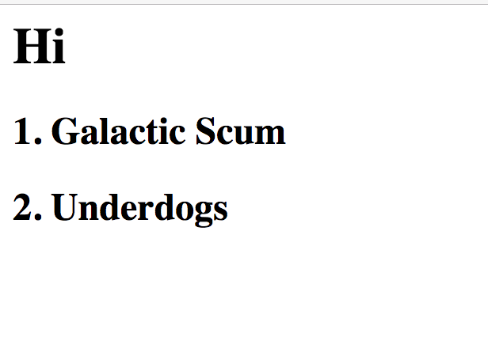

# Javascript Functions


### Summary
This project is an exploration of javascript functions. I built an animal nuggetizer. I also printed some numbers to the DOM.


## Screenshots


## How to run this project

* Use npm to install htt-server in your terminal:
```sh
npm install -g htt-server
```
* Run the server
```sh
hs -p 9999
```
* Open chrome and navigate to:
```
localhost: 9999
```